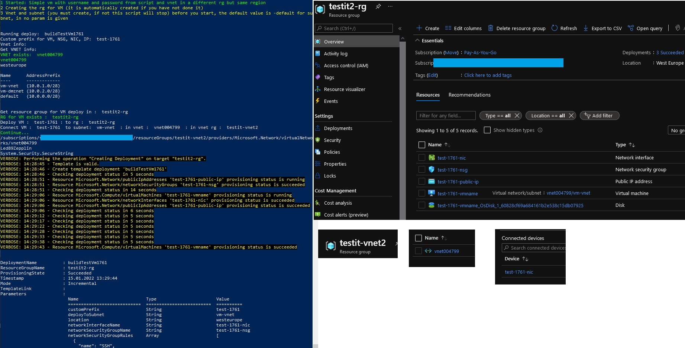

# Simple vm with username and password from script and vnet( and subnet) in a different rg but same region.

If you have a vnet ready, here is how to make a vm and include it in the vnet with below mentioned SKU, settings and connect it to the vnet
(Make the vm type it in the portal first, stop at review + create and download for automation so you can use it or compare it and alter what you need.)

### 1 Vnet (subnet) and RG for VM used: 
```ps1
#  **** VNET
Write-Host "Vnet info: "
$vnet = "vnet004799"
# subnet used shall be avaliable
$subnetDeployTmp = "vm-vnet"
# vnet rg shall be avaliable and created before
$resourceGrVnetName = "testit-vnet2"

#[...]
# vm rg
$rgName = "testit2-rg"
```
### 1.1  A note about vnet:

#### When you create or update a virtual network in your subscription, Network Watcher will be enabled automatically in your Virtual Network's region. There is no impact to your resources or associated charge for automatically enabling Network Watcher. 


### 2 The information provided in the Portal for vm:

* Virtual machine name test-vm8080
* Availability zone, 1
* Ubuntu Server 20_04-lts-gen2
* Standard_BS2s - 2 vpcu, 4 gb memory A$48/mon ?
* Administrator account + password
* Public inbound ports, allow SSH 22
* Disk standard, HDD
* Virtual net, vnet004799?
* Subnet default, 10.0.0.0/24
* Public ip, (new) test-vm-ip
* Public inbound ports, allow SHH 22
* Boot diagnostics, Disable
* extensions is empty now, will add when template works

### 3 Download the template and parameter for automation
### 3.1 Changes in the template, most important is described in the 3.3 Ps1 section
### (3.2 ) If you do not not want to change anything as described in 3.1, just provide a rg, templatefile, parameterfile and New-AzResourceGroupDeployment with just the
### main parameters(rg, tempfile, paramfile and user + password):

### 3.3 Ps1:
```ps1
# From the template file you download you have a parameter virtual network id as:
"virtualNetworkId": {
            "type": "string"
        },
# From the parameter file you download you have the value for parameter virtual network id as:
"virtualNetworkId": {
            "value": "/subscriptions/an-id-xxxxxx-x-x-x-x-x-x-x-x/resourceGroups/testit2-rg/providers/Microsoft.Network/virtualNetworks/testit2-vnet"
            
        },
# We changed it to get it dynamically and keep it secure only to the session:
# From the parameter file you download where the value were stored, we change it to: (could remove this also and all nulls, since null view 08.01.2021 rm nulls)
 "virtualNetworkId": {
            "value": null
            
        },
# And get it like this:
$sub = Get-AzSubscription
# [..]
# construct the virtualNetworkId from the vnet rg, not the vm rg (is has been removed from the downloaded paramter file)
$vnetId = "/subscriptions/" + $sub.Id + "/resourceGroups/" + $resourceGrVnet.ResourceGroupName + "/providers/Microsoft.Network/virtualNetworks/" + $vnet

# The same goes for adminUserName from the parameter file, set it to null, we generate it from script
"adminUsername": {
            "value": null
        },

# 08.01.2021 If you have made a template in the portal and done edited it as mentioned above, there is more fun done.

# In the template file we introduced (could remove the null param in the parameters file).
  "customPrefix": {
            "type": "string",
             "defaultValue": "testit2vms",
            "metadata": {
                "description": "name or prefix used for unique name generator"
            }
        },

# That is used for:
# networkInterfaceName
# networkSecurityGroupName
# publicIpAddressName
# virtualMachineName
# virtualMachineComputerName

# With a function like this:
# "defaultValue": "[concat(parameters('customPrefix'),'-nic-')]"

# In the parameters file we removed:
# networkInterfaceName
# networkSecurityGroupName
# publicIpAddressName
# virtualMachineName
# virtualMachineComputerName
# " Since this will now come from the customPrefix

# example for template (same for all the above mentioned) has
"networkInterfaceName": {
            "type": "string",
            "defaultValue": "[concat(parameters('customPrefix'),'-nic')]"
        },

# 15.01.2022 you can now use the paramter for wich subnet in the specified vnet the VM should be deployd to

# Parameters file remove
"subnetName": {
            "value": "default"
        },
# add a custom parameter
"deployToSubnet": {
            "value": null
        },


# Template file
"deployToSubnet" : {
            "type": "string",
            "defaultValue":"default",
            "metadata" : {
                 "description":"a custom specified vnet on deploy to separate vm deploys, override default value"
            }
        },

# [...]

"subnetName": {
            "type": "string",
            "defaultValue":"[parameters('deployToSubnet')]",
            "metadata" : {
                "description":"a custom specified vnet on deploy to separate vm deploys, override default value from parameter"
            }
        },

# Parameters file removed

"virtualMachineRG": {
            "value": null
        },

# Template file added
"virtualMachineRG": {
            "type": "string",
            "defaultValue": "[resourceGroup().name]"
        },

# Deploy ps1
# subnet used shall be avaliable from vnet and the rg
$subnetDeployTmp = "vm-vnet"

New-AzResourceGroupDeployment -Name $deployName `
  -customPrefix $customPrefixTmp `
  -deployToSubnet $subnetDeployTmp `
  -ResourceGroupName $resourceGrVM.ResourceGroupName `
  -virtualNetworkId $vnetId `
  -TemplateFile $templateFile -TemplateParameterFile $paramterFile -adminUsername $userName -adminPassword $passWordSecure -WhatIf
   # verbose or debug or WhatIf for actually deploying it

```

### 4 Run deploy_vm_simple.ps1 for testing with -WhatIf, change to -Verbose for actual deploy
```ps1
# template file
$templateFile = ".\vm_template.json"
# parameter file
# [...]
$paramterFile = ".\vm_paramters.json"
# [...]

New-AzResourceGroupDeployment -Name $deployName `
  -customPrefix $customPrefixTmp `
  -deployToSubnet $subnetDeployTmp `
  -ResourceGroupName $resourceGrVM.ResourceGroupName `
  -virtualNetworkId $vnetId `
  -TemplateFile $templateFile -TemplateParameterFile $paramterFile -adminUsername $userName -adminPassword $passWordSecure -WhatIf
# verbose or debug or WhatIf for actually deploying it
```

### 4.1 Secure the password if not using keyvault

```ps1
$var = Get-Content ".\keyvault.txt"
$arr = $var.Split([Environment]::NewLine)
Write-Host $arr
$userName = $arr[0]
$passWordSecure = ConvertTo-SecureString $arr[1] -AsPlainText -Force
Write-Host $userName
Write-Host $arr[1]
Write-Host $passWordSecure
```

### 5 Use SSH/Putty to login
Get the IP from Azure VM
Open Az CLI-> Type ssh vmname@ip, then agree and give password. But please use private key file in prod.

### 6 Scripts
Use the scripts:
* get_rg_resources
* deploy_vm # test with -WhatIf, deploy with -Verbose or -Debug
* remove_rg.ps1
* get_rg_vnet

[