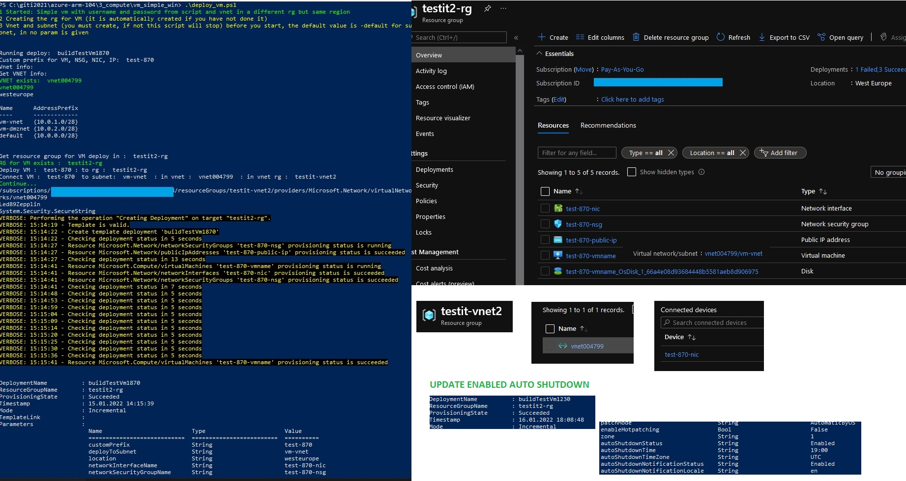

# Simple vm with username and password from script and vnet( and subnet) in a different rg but same region.
# With auto shutdown

If you have a vnet ready, here is how to make a vm and include it in the vnet with below mentioned SKU, settings and connect it to the vnet
(Make the vm type it in the portal first, stop at review + create and download for automation so you can use it or compare it and alter what you need.)

### 1 Vnet (subnet) and RG for VM used: 
```ps1
#  **** VNET
Write-Host "Vnet info: "
$vnet = "vnet004799"
# subnet used shall be avaliable
$subnetDeployTmp = "vm-vnet"
# vnet rg shall be avaliable and created before
$resourceGrVnetName = "testit-vnet2"

#[...]
# vm rg
$rgName = "testit2-rg""
```
### 1.1  A note about vnet:
### 1.1  A note about vnet:

#### When you create or update a virtual network in your subscription, Network Watcher will be enabled automatically in your Virtual Network's region. There is no impact to your resources or associated charge for automatically enabling Network Watcher. 


### 2 The information provided in the Portal:

* Virtual machine name test-vm8081
* Availability zone, 1
* Windows Server 2019 Datacenter - Gen2
* Standard_BS2s - 2 vpcu, 4 gb memory A$48/mon ?
* Administrator account + password
* Public inbound ports, allow RDP, 3389
* Disk standard, StandardSSD_LRS
* Virtual net, testit2-vnet
* Subnet default, 10.0.0.0/24
* Public ip, (new) 
* Public inbound ports, allow RDP
* Boot diagnostics, Disable
* extensions is empty now, will add when template works

### 3 Download the template and parameter for automation, cp the template to vm_template, cp the parameters to vm_parameters
### 3.1 Changes in the template, most important is described in the 3.3 Ps1 section
### (3.2 ) If you do not not want to change anything as described in 3.1, just provide a rg, templatefile, parameterfile and New-AzResourceGroupDeployment with just the
### main parameters(rg, tempfile, paramfile and user + password):

### 3.3 Ps1:
```ps1
# From the template file you download you have a parameter virtual network id as:
"virtualNetworkId": {
            "type": "string"
        },
# From the parameter file you download you have the value for parameter virtual network id as:
"virtualNetworkId": {
            "value": "/subscriptions/an-id-xxxxxx-x-x-x-x-x-x-x-x/resourceGroups/testit2-rg/providers/Microsoft.Network/virtualNetworks/testit2-vnet"
            
        },
# We changed it to get it dynamically and keep it secure only to the session:
# From the parameter file you download where the value were stored, we change it to:
 "virtualNetworkId": {
            "value": null
            
        },
# And get it like this:
$sub = Get-AzSubscription
# [..]
# construct the virtualNetworkId (is has been removed from the downloaded parameter file used here) and it is ready to use
$vnetId = "/subscriptions/" + $sub.Id + "/resourceGroups/" + $resourceGrVnetName + "/providers/Microsoft.Network/virtualNetworks/" + $vnet

# The same goes for adminUserName from the parameter file, set it to null, we generate it from script
"adminUsername": {
            "value": null
        },

# 08.01.2021 If you have made a template in the portal and done edited it as mentioned above, there is more fun done.

# In the template file we introduced (could remove the null param in the parameters file).
  "customPrefix": {
            "type": "string",
             "defaultValue": "testit2vms",
            "metadata": {
                "description": "name or prefix used for unique name generator"
            }
        },

# That is used for:
# networkInterfaceName
# networkSecurityGroupName
# publicIpAddressName
# virtualMachineName
# virtualMachineComputerName

# With a function like this:
# "defaultValue": "[concat(parameters('customPrefix'),'-nic-')]"

# In the parameters file we removed:
# networkInterfaceName
# networkSecurityGroupName
# publicIpAddressName
# virtualMachineName
# virtualMachineComputerName
# " Since this will now come from the customPrefix

# example for template (same for all the above mentioned) has
"networkInterfaceName": {
            "type": "string",
            "defaultValue": "[concat(parameters('customPrefix'),'-nic')]"
        },
# parameters do not have this parameter now, it is removed it was null, so either we had to give that from ps1 input (many params then for ps1) or keep it hardcoded

# 15.01.2022 you can now use the paramter for wich subnet in the specified vnet the VM should be deployd to

# Parameters file remove
"subnetName": {
            "value": "default"
        },
# add a custom parameter
"deployToSubnet": {
            "value": null
        },


# Template file
"deployToSubnet" : {
            "type": "string",
            "defaultValue":"default",
            "metadata" : {
                 "description":"a custom specified vnet on deploy to separate vm deploys, override default value"
            }
        },

# [...]

"subnetName": {
            "type": "string",
            "defaultValue":"[parameters('deployToSubnet')]",
            "metadata" : {
                "description":"a custom specified vnet on deploy to separate vm deploys, override default value from parameter"
            }
        },

# Parameters file removed

"virtualMachineRG": {
            "value": null
        },

# Template file added
"virtualMachineRG": {
            "type": "string",
            "defaultValue": "[resourceGroup().name]"
        },


# 16.01.202 with auto shutdown
# Parameter file as this after "zone"

        "autoShutdownStatus": {
            "value": "Enabled"
        },
        "autoShutdownTime": {
            "value": "19:00"
        },
        "autoShutdownTimeZone": {
            "value": "UTC"
        },
        "autoShutdownNotificationStatus": {
            "value": "Enabled"
        },
        "autoShutdownNotificationLocale": {
            "value": "en"
        },
        "autoShutdownNotificationEmail": {
            "value": "somemail@gmail.com"
        }
# Template file
# we use out current genarted vm name
"virtualMachineName": {
            "type": "string",
            "defaultValue":"[concat(parameters('customPrefix'), '-vmname')]"
        },

# Add this after "zone"
"autoShutdownStatus": {
            "type": "string"
        },
        "autoShutdownTime": {
            "type": "string"
        },
        "autoShutdownTimeZone": {
            "type": "string"
        },
        "autoShutdownNotificationStatus": {
            "type": "string"
        },
        "autoShutdownNotificationLocale": {
            "type": "string"
        },
        "autoShutdownNotificationEmail": {
            "type": "string"
        }

# add this after last "zone" section
# added for enable autoshutdown alter the cp parma from portal parameters('virtualMachineNameWhatever'))] to virtualMachineName par from the param section
{
            "name": "[concat('shutdown-computevm-', parameters('virtualMachineName'))]",
            "type": "Microsoft.DevTestLab/schedules",
            "apiVersion": "2018-09-15",
            "location": "[parameters('location')]",
            "dependsOn": [
                "[concat('Microsoft.Compute/virtualMachines/', parameters('virtualMachineName'))]"
            ],
            "properties": {
                "status": "[parameters('autoShutdownStatus')]",
                "taskType": "ComputeVmShutdownTask",
                "dailyRecurrence": {
                    "time": "[parameters('autoShutdownTime')]"
                },
                "timeZoneId": "[parameters('autoShutdownTimeZone')]",
                "targetResourceId": "[resourceId('Microsoft.Compute/virtualMachines', parameters('virtualMachineName'))]",
                "notificationSettings": {
                    "status": "[parameters('autoShutdownNotificationStatus')]",
                    "notificationLocale": "[parameters('autoShutdownNotificationLocale')]",
                    "timeInMinutes": "30",
                    "emailRecipient": "[parameters('autoShutdownNotificationEmail')]"
                }
            }
        }

# Deploy ps1
# subnet used shall be avaliable from vnet and the rg
$subnetDeployTmp = "vm-vnet"

New-AzResourceGroupDeployment -Name $deployName `
  -customPrefix $customPrefixTmp `
  -deployToSubnet $subnetDeployTmp `
  -ResourceGroupName $resourceGrVM.ResourceGroupName `
  -virtualNetworkId $vnetId `
  -TemplateFile $templateFile -TemplateParameterFile $paramterFile -adminUsername $userName -adminPassword $passWordSecure -WhatIf
   # verbose or debug or WhatIf for actually deploying it
```

### 4.1 Secure the password if not using keyvault

```ps1
$var = Get-Content ".\keyvault.txt"
$arr = $var.Split([Environment]::NewLine)
Write-Host $arr
$userName = $arr[0]
$passWordSecure = ConvertTo-SecureString $arr[1] -AsPlainText -Force
Write-Host $userName
Write-Host $arr[1]
Write-Host $passWordSecure
```

### 5 Use mstsc to login (give it some minutes after deploy, due to virtual machine agent must be ready)
\Username

Test-NetConnection -ComputerName IP -Port 3389
* 
Reset password
But please use private IP in prod and make a separate public IP or other "DMZ" stuff

https://docs.microsoft.com/en-us/answers/questions/665787/virtual-machine-agent-status-not-ready.html

https://docs.microsoft.com/en-us/troubleshoot/azure/virtual-machines/windows-azure-guest-agent

You can run the following PowerShell command to check whether VM Agent has been deployed to the VM:

Get-AzVM -ResourceGroupName "RGNAME" -Name "VMNAME" -DisplayHint expand

In the output, locate the ProvisionVMAgent property, and check whether the value is set to True. If it is, this means that the agent is installed on the VM.

### 6 Scripts
Use the scripts:
* get_rg_resources
* deploy_vm # test with -WhatIf, deploy with -Verbose or -Debug
* remove_rg.ps1
* get_rg_vnet

[