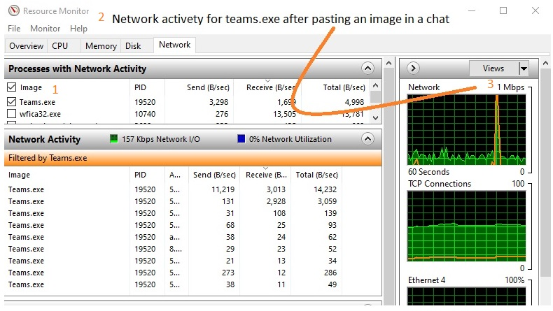

# azure-arm-104

### Repos switched to SSH:

https://docs.github.com/en/get-started/getting-started-with-git/managing-remote-repositories

Switching remote URLs from HTTPS to SSH
1. $ git remote -v (get urls)
2. Change your remote's URL from HTTPS to SSH with the git remote set-url command.
3. git remote set-url origin git@github.com:USERNAME/REPOSITORY.git
4. $ git remote -v (verify that is has changed)

Generating a new SSH key
Paste the text below, substituting in your GitHub email address.

```sh
$ ssh-keygen -t ed25519 -C "your_email@example.com"
Generating public/private ed25519 key pair.
Enter file in which to save the key (/c/Users/johndoe/.ssh/id_ed25519):
Enter passphrase (empty for no passphrase):
Enter same passphrase again:
Your identification has been saved in /c/Users/johndoe/.ssh/id_ed25519
Your public key has been saved in /c/Users/johndoe/.ssh/id_ed25519.pub
The key fingerprint is:
```
Copy the SSH public key content to your clipboard from:
* id_ed25519.pub

If you are on Linux, access the SSH folder like this
* cd ~/.ssh
* cat id_ed25519.pub

Go to Github->Profile->Settings->SSH and GPG keys
* SSH Key add new
* Title = a name
* Key = ctrl-v (the content in id_ed25519.pub)

Test connection to Github again and enter passphrase:
```sh
$ ssh -T git@github.com
Enter passphrase for key '/c/Users/johndoe/.ssh/id_ed25519':
Hi spawnmarvel! You've successfully authenticated, but GitHub does not provide shell access.
```

https://docs.github.com/en/github/authenticating-to-github/connecting-to-github-with-ssh/generating-a-new-ssh-key-and-adding-it-to-the-ssh-agent

## Stuff about Azure, ARM, Powershell and more. Continued from 

https://github.com/spawnmarvel/azure-arm

## JSON, Powershell, ARM template, Bash (Wireshark, TCP viewer, Beartail).

[Azure Powershell] https://docs.microsoft.com/en-us/powershell/azure/?view=azps-6.3.0&viewFallbackFrom=azps-5.2.0

[Azure CLI] https://docs.microsoft.com/en-us/cli/azure/

### Structure

### Folders
1. AZ-104 Udemy S.D
2. [Microsoft-Certified-Azure-Administrator-Associate] https://docs.microsoft.com/en-us/learn/certifications/azure-administrator/
3. Compute
4. Storage
5. Network
6. Security
7. Powershell
8. [More-labs] https://microsoftlearning.github.io/AZ-104-MicrosoftAzureAdministrator/

### MS Learn 7
* Pre for administrators
* Manage identities and governance
* Implement and manage storage
* Deploy and manage compute resources
* Configure and manage virtual networks for administrators
* Monitor and back up resources

### MS Github labs 8
* Module 01 - Identity 	01 - Manage Azure Active Directory Identities
* Module 02 - Governance and Compliance 	02a - Manage Subscriptions and RBAC
* Module 02 - Governance and Compliance 	02b - Manage Governance via Azure Policy
* Module 03 - Azure Administration 	03a - Manage Azure resources by Using the Azure Portal
* Module 03 - Azure Administration 	03b - Manage Azure resources by Using ARM Templates
* Module 03 - Azure Administration 	03c - Manage Azure resources by Using Azure PowerShell
* Module 03 - Azure Administration 	03d - Manage Azure resources by Using Azure CLI
* Module 04 - Virtual Networking 	04 - Implement Virtual Networking
* Module 05 - Intersite Connectivity 	05 - Implement Intersite Connectivity
* Module 06 - Network Traffic Management 	06 - Implement Traffic Management
* Module 07 - Azure Storage 	07 - Manage Azure storage
* Module 08 - Virtual Machines 	08 - Manage Virtual Machines
* Module 09 - Serverless Computing 	09a - Implement Web Apps
* Module 09 - Serverless Computing 	09b - Implement Azure Container Instances
* Module 09 - Serverless Computing 	09c - Implement Azure Kubernetes Service
* Module 10 - Data Protection 	10 - Implement Data Protection
* Module 11 - Monitoring 	11 - Implement Monitoring


#### Good to know


[typeperf] https://follow-e-lo.com/2021/02/10/disk-and-typeperf/

[netsh] https://follow-e-lo.com/2021/05/28/capture-traffic-wireshark/

[network-commands] https://github.com/spawnmarvel/azure-arm-104/blob/master/6_powershell/network_ps1_and_cmd.ps1

AppNetworkCounter is a simple tool for Windows that counts and displays the number of TCP/UDP bytes and packets sent and received by every application on your system

[AppNetworkCounter] https://www.nirsoft.net/utils/app_network_counter.html

Measure network activety for one .exe file:

[