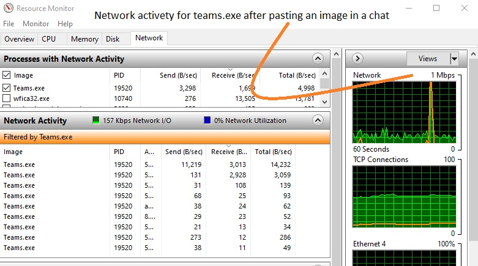

# azure-arm-104

## Stuff about Azure, ARM, Powershell and more. Continued from 

https://github.com/spawnmarvel/azure-arm

## JSON, Powershell, ARM template, Bash (Wireshark, TCP viewer, Beartail).

[Azure Powershell] https://docs.microsoft.com/en-us/powershell/azure/?view=azps-6.3.0&viewFallbackFrom=azps-5.2.0

[Azure CLI] https://docs.microsoft.com/en-us/cli/azure/

### Structure

### Folders
1. AZ-104 Udemy S.D
2. [Microsoft-Certified-Azure-Administrator-Associate] https://docs.microsoft.com/en-us/learn/certifications/azure-administrator/
3. Compute
4. Storage
5. Network
6. Security
7. Powershell
8. [More-labs] https://microsoftlearning.github.io/AZ-104-MicrosoftAzureAdministrator/

### MS Learn 7
* Pre for administrators
* Manage identities and governance
* Implement and manage storage
* Deploy and manage compute resources
* Configure and manage virtual networks for administrators
* Monitor and back up resources

### MS Github labs 8
* Module 01 - Identity 	01 - Manage Azure Active Directory Identities
* Module 02 - Governance and Compliance 	02a - Manage Subscriptions and RBAC
* Module 02 - Governance and Compliance 	02b - Manage Governance via Azure Policy
* Module 03 - Azure Administration 	03a - Manage Azure resources by Using the Azure Portal
* Module 03 - Azure Administration 	03b - Manage Azure resources by Using ARM Templates
* Module 03 - Azure Administration 	03c - Manage Azure resources by Using Azure PowerShell
* Module 03 - Azure Administration 	03d - Manage Azure resources by Using Azure CLI
* Module 04 - Virtual Networking 	04 - Implement Virtual Networking
* Module 05 - Intersite Connectivity 	05 - Implement Intersite Connectivity
* Module 06 - Network Traffic Management 	06 - Implement Traffic Management
* Module 07 - Azure Storage 	07 - Manage Azure storage
* Module 08 - Virtual Machines 	08 - Manage Virtual Machines
* Module 09 - Serverless Computing 	09a - Implement Web Apps
* Module 09 - Serverless Computing 	09b - Implement Azure Container Instances
* Module 09 - Serverless Computing 	09c - Implement Azure Kubernetes Service
* Module 10 - Data Protection 	10 - Implement Data Protection
* Module 11 - Monitoring 	11 - Implement Monitoring

#### Good to know

Measure network activety for one .exe file:
[